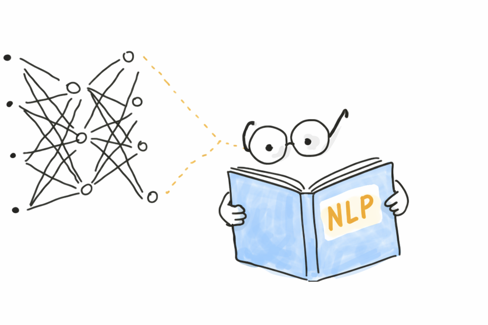

<a href="https://oscar-defelice.github.io">

</a>

# Natural Language Processing lectures

<p align="center">

</p>

<br>
<br />

This repository contains the material for a **30-hour course in Natural Language Processing (NLP)**,
organised as **10 lectures**, each combining theoretical foundations and hands-on practical sessions (*travaux pratiques*).

The course follows a progressive path:
**symbolic methods → probabilistic models → neural networks → transformers**, with a strong emphasis on
*building things from scratch* and *controlled empirical comparison*.

This course is part of a broader series of lecture modules:

1. [Introduction to Data Science](https://oscar-defelice.github.io/DSAcademy-lectures) 🧮
2. [Statistical Learning](https://oscar-defelice.github.io/ML-lectures) 📈
3. [Time Series](https://oscar-defelice.github.io/TimeSeries-lectures) ⌛
4. [Computer Vision Hands-On](https://oscar-defelice.github.io/Computer-Vision-Hands-on) 🕶️
5. [Recommender Systems](https://oscar-defelice.github.io/Recommender-Systems-Course) 🚀
6. [Deep Learning](https://oscar-defelice.github.io/DeepLearning-lectures) 💬

---

## Course structure

Each lecture is organised as:

- **~1h theory**
- **~2h practical session (TP)**

The practical sessions are cumulative: students progressively build a reusable NLP pipeline rather than
starting from scratch at every step.

### Lecture outline

1. Tokenisation, text normalisation, datasets, datasheets  
2. Language models and n-grams  
3. Naive Bayes and evaluation metrics  
4. Logistic regression and optimisation  
5. Vector semantics and embeddings  
6. Feedforward neural networks  
7. Recurrent neural networks  
8. Attention mechanisms  
9. Transformers and large language models  
10. Final project presentations  

---

## Repository organisation

```bash
nlp-course/
├── data/ # datasets (raw, processed, datasheets)
├── img/ # images used in README / slides
│
├── src/
│ ├── tp01_tokenization/ # tokenisation, normalisation, datasets
│ ├── tp02_ngrams/ # n-gram language models
│ ├── tp03_naive_bayes/ # Naive Bayes & evaluation
│ ├── tp04_logistic_regression/
│ ├── tp05_embeddings/ # vector semantics & embeddings
│ ├── tp06_ffnn/ # feedforward neural networks
│ ├── tp07_rnn/ # recurrent neural networks
│ ├── tp08_attention/ # attention mechanisms
│ ├── tp09_transformers/ # transformers & LLMs
│ └── utils/ # shared infrastructure (tokenisation, datasets, metrics, training)
│
├── .github/ # GitHub actions / templates
├── .gitignore
├── Dockerfile
├── Makefile
├── environment.yml
├── requirements.txt
├── requirements-macm1.txt
├── fullpull.sh
└── README.md
```

---

## Install requirements

Install requirements As usual, it is advisable to create a virtual environment to isolate dependencies. One can follow [this guide](https://packaging.python.org/guides/installing-using-pip-and-virtual-environments/) and the suitable section according to the OS. Once the virtual environment has been set up, one has to run the following instruction from a command line

bash
pip install -r requirements.txt
This installs all the packages the code in this repository needs.

```bash
pip install -r requirements.txt
```

(Requirement files will be provided as the course progresses.)

---

## Your lecturer 👨‍🏫

### [Oscar de Felice](https://oscar-defelice.github.io/) <a href="https://oscar-defelice.github.io/" target="_blank" rel="that's me!"></a> I am a theoretical physicist, a passionate programmer and an AI curious. I write medium articles (with very little amount of regularity), you can read them [here](https://oscar-defelice.medium.com/). I also have a [github profile](https://github.com/oscar-defelice) where I store my personal open-source projects. I am a theoretical physicist working at the intersection of machine learning natural language processing, and computational biology

📫 [Reach me!](mailto:oscar.defelice@gmail.com)
[](https://github.com/oscar-defelice)
[](https://oscar-defelice.github.io)
[](https://twitter.com/OscardeFelice)
[](https://linkedin.com/in/oscar-de-felice-5ab72383/)

### Questions

<p align="center">  </p> If you have any question, doubt or if you find mistakes, please open an issue or drop me an [email](mailto:oscar.defelice@gmail.com).

#### Buy me a coffee ☕️

If you like these lectures, consider to buy [me a coffee ☕️](https://github.com/sponsors/oscar-defelice)!
<p align="center"> <a href="https://github.com/sponsors/oscar-defelice"></a> </p> --- <p align="left"> <a href = "https://hub.docker.com/repository/docker/oscardefelice/deep-learning-lectures/general">  </a>&nbsp; <a href = "https://github.com/oscar-defelice/DeepLearning-lectures">  </a>&nbsp; <a href = "https://oscar-defelice.github.io/DeepLearning-lectures">  </a>&nbsp; </p>
